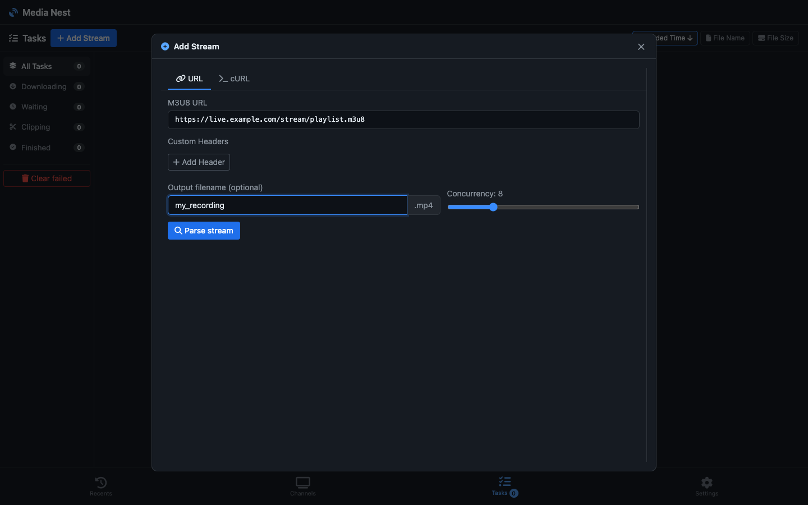
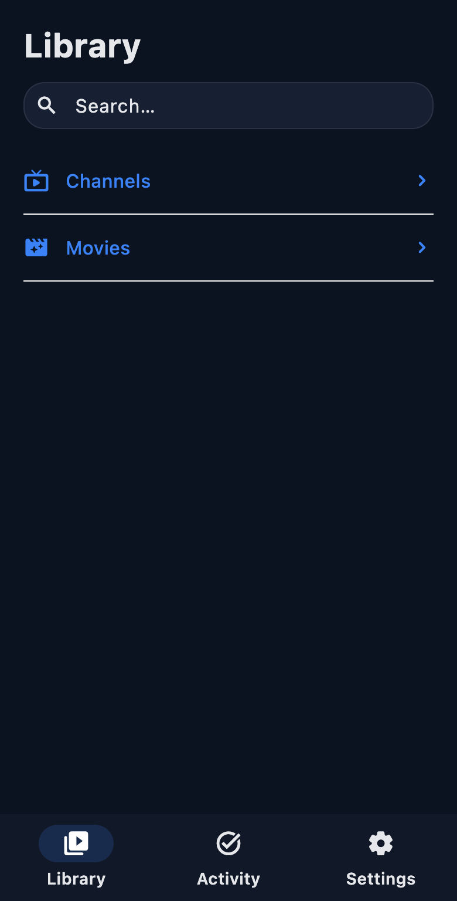

# Media Nest — Rust-powered local-first media archive

Media Nest is a local-first toolkit for archiving, previewing, clipping, and managing HLS/M3U8 sources that you control or are authorised to access.
It combines a shared Rust download engine, an Axum-based web app, and a Flutter client that runs the same workflow on-device through a local embedded server.

Media Nest assumes you are working with sources you control or are authorised to access — not scraping public platforms you do not manage.

## Screenshots





## Highlights

- Shared Rust core for the web server and mobile app
- Offline archiving, clipping, preview playback, and export workflows
- Playlist and channel management with merged editing and health checks
- Local-first mobile flow powered by an embedded localhost server

## Architecture

- `crates/m3u8-core` — shared download, parsing, decryption, and merge engine
- `crates/server` — Axum API + WebSocket server for the browser UI
- `crates/mobile-ffi` — FFI bridge used by the Flutter app
- `flutter/` — Flutter client that talks to the embedded localhost server

## Web app quick start

```bash
make frontend-build
cargo run -p server
```

## Flutter quick start

```bash
make flutter-prepare
make flutter-run-macos
```

## Build and test

```bash
make test
cargo check -p server
./tests/test_api.sh
```

## Should this project use Pretext?

No — not for the current frontend. The browser app uses imperative DOM updates and `IntersectionObserver`-based batching rather than custom multiline text layout, canvas rendering, or DOM-measurement-heavy text virtualisation. Revisit Pretext only if the UI evolves toward text-heavy pre-layout or manual rendering.
