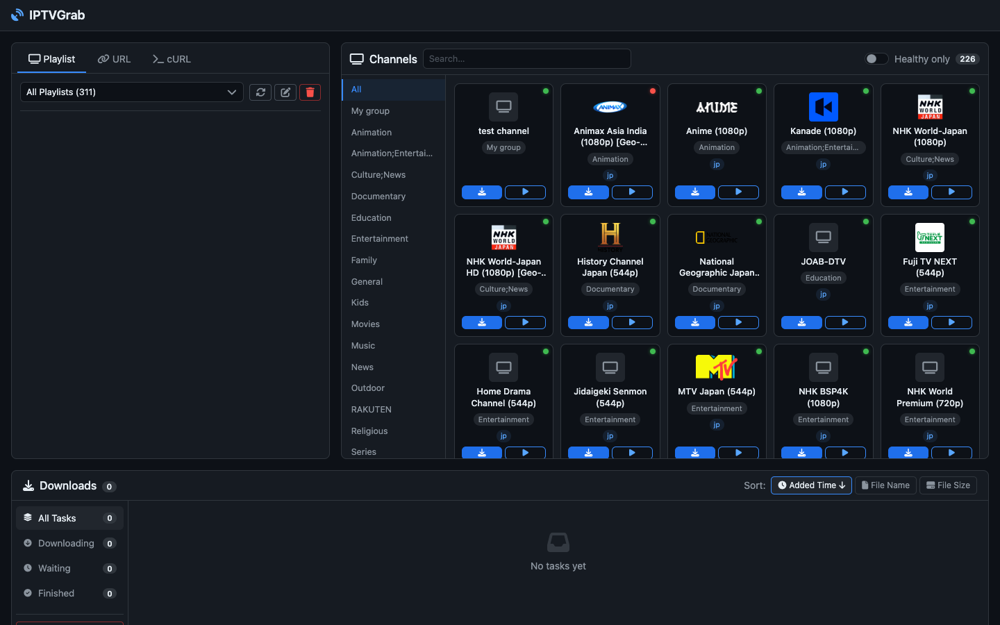
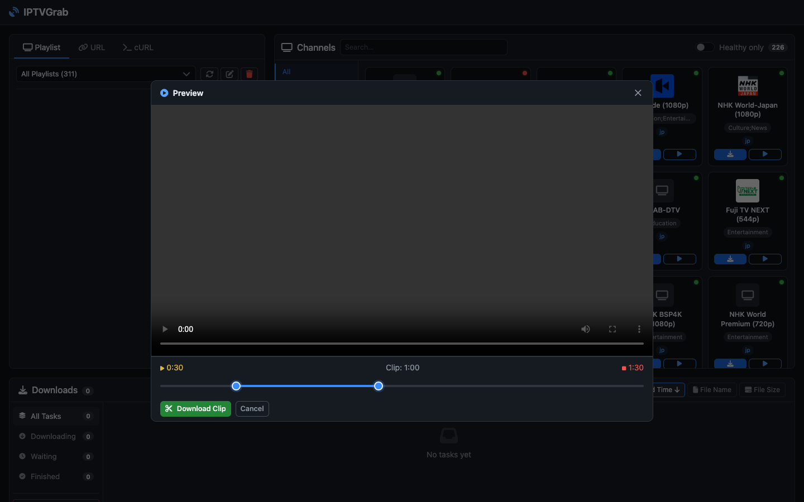

# IPTVGrab

**M3U8 & IPTV stream downloader** — paste a URL or `curl` command, browse IPTV channels, and save streams as MP4. Runs entirely in the browser, no desktop app needed.

---

## Screenshots

### IPTV channel browser



Browse channels from your IPTV playlist, filtered by group. Click any card to start recording instantly.

---

## Features

- **IPTV playlist browser** — load M3U/M3U8 playlists by URL or raw text; browse and filter channels by name or group; one-click recording
- **URL & cURL input** — paste a plain M3U8 URL or a full `curl` command from Chrome DevTools (all headers extracted automatically)
- **Master playlist** — auto-lists all quality variants; pick the resolution you want
- **Concurrent download** — configurable segment concurrency (1–32, default 8)
- **AES-128 decryption** — transparent key fetch + CBC decrypt per segment
- **CMAF / fMP4** — handles `#EXT-X-MAP` init segments; binary-concatenates + re-muxes via ffmpeg
- **Live stream recording** — polls playlist, deduplicates segments, records until stopped, then merges to MP4
- **Video preview** — in-browser HLS preview via hls.js while a download is still in progress
- **Video clip** — trim any completed or in-progress download to a shorter MP4 using dual range sliders in the preview player; works while recording is still running
- **Resume** — interrupted downloads resume from the last segment on server restart
- **Task persistence** — task history survives server restarts (`tasks.json` inside the downloads dir)
- **Access control** — optional password protection; IP locked for 5 minutes after 5 failed login attempts

---

## Quick start

```bash
# 1. Install dependencies (Python 3.9+ required)
pip install -r requirements.txt

# 2. Start on default port 8765
python3 run.py

# 3. Custom port and download directory
python3 run.py --port 9000 --downloads-dir /mnt/videos

# 4. With password protection
AUTH_PASSWORD=secret python3 run.py

# 5. Development mode (auto-reload on code changes)
python3 run.py --dev
```

Open **http://localhost:8765** in your browser.

**Note:** On macOS with Homebrew Python, you may need to install with:
```bash
pip3 install --break-system-packages -r requirements.txt
```

### CLI options

| Flag | Short | Default | Description |
|---|---|---|---|
| `--port` | `-p` | `8765` | TCP port |
| `--downloads-dir` | `-d` | `./downloads` | Where MP4 files are saved |
| `--host` | | `0.0.0.0` | Bind address |
| `--dev` | | off | Enable uvicorn auto-reload for development |

Environment variables `PORT`, `DOWNLOADS_DIR`, and `AUTH_PASSWORD` are also respected (CLI flags take precedence).

**ffmpeg requirement:** FFmpeg must be installed and available on your `$PATH`. It is used for merging segments into the final MP4 file.

```bash
# macOS
brew install ffmpeg

# Ubuntu/Debian
sudo apt-get install ffmpeg

# Verify installation
ffmpeg -version
```

---

## Docker

### docker-compose (recommended)

```bash
docker compose up -d          # start in background
docker compose logs -f        # follow logs
docker compose down           # stop
```

The default `docker-compose.yml` mounts `./downloads` on the host to `/downloads` inside the container.
Edit the file to change the port or mount path:

```yaml
services:
  iptvgrab:
    build: .
    ports:
      - "8765:8765"
    volumes:
      - /your/path:/downloads
    environment:
      - DOWNLOADS_DIR=/downloads
```

### Build & run manually

```bash
docker build -t iptvgrab .

docker run -d \
  -p 8765:8765 \
  -v "$(pwd)/downloads:/downloads" \
  --name iptvgrab \
  iptvgrab
```

### Environment variables

| Variable | Default | Description |
|---|---|---|
| `DOWNLOADS_DIR` | `/downloads` | Output path inside the container |
| `PORT` | `8765` | Port the server listens on |
| `AUTH_PASSWORD` | _(unset)_ | If set, enables password login at `/login` |

---

## UI overview

### Left panel — Input

Three tabs:

| Tab | Purpose |
|-----|---------|
| **Playlist** | Load a saved IPTV playlist by URL or raw M3U text. Filter channels by name or group, then click a card to record. |
| **URL** | Enter a direct M3U8 URL with optional custom headers. |
| **cURL** | Paste a `curl` command from Chrome DevTools → *Copy as cURL*. URL and all headers are extracted automatically. |

### Right panel — Stream info / Channel grid

- **Playlist tab active** → channel grid: searchable, filterable by group
- **URL / cURL tab active** → stream info after parsing:
  - Master playlist: quality variant list (resolution · bitrate · codec)
  - VOD media playlist: segment count, total duration, encryption status
  - Live stream: 🔴 **LIVE** badge; records until stopped, then merges to MP4

### Bottom — Download tasks

| Status | Progress bar | Action |
|--------|-------------|--------|
| Queued | Gray | Cancel |
| Downloading | Blue — speed, bytes, percent | Cancel |
| Recording | Red animated stripes — segment count, speed, elapsed time | Stop |
| Merging | Blue at 99% | — |
| Completed | Green 100% — file size, total time | Download MP4 |
| Failed | Red — error message | Delete / Retry |
| Cancelled | Gray | Delete |

While **downloading or recording**, a **Preview** button opens a modal playing already-downloaded segments live via hls.js.

### Video clip

Any completed or actively downloading/recording task can be clipped to a shorter segment:



1. Click the **Clip** button on a task card (scissors icon, shown on completed and in-progress tasks)
   — or, while the preview modal is open, click the **Clip** toggle in the player toolbar.
2. The preview modal opens (if not already) and a clip toolbar appears below the video.
3. Drag the **start** and **end** range sliders to define your clip range. The video scrubs to the selected position as you drag so you can find the exact frame.
4. The **Clip: X:XX** label shows the selected duration in real time.
5. Click **Download Clip** — the server runs ffmpeg in the background and the trimmed file downloads automatically.

Clip files are saved alongside the full download as `{name}_clip_{HH-MM-SS}-{HH-MM-SS}.mp4`.

> **In-progress clip** — clipping works even while a download or live recording is still running. The server grabs the segments available at that moment and produces the clip immediately without interrupting the main download.

---

## API reference

| Method | Path | Description |
|---|---|---|
| `GET` | `/login` | Login page (when auth is enabled) |
| `POST` | `/api/login` | Submit password, receive session cookie |
| `POST` | `/api/logout` | Invalidate session |
| `GET` | `/api/auth/status` | `{ "auth_required": bool }` |
| `POST` | `/api/parse` | Parse an M3U8 URL or curl command |
| `POST` | `/api/download` | Start a download / recording task |
| `GET` | `/api/tasks` | List all tasks |
| `GET` | `/api/tasks/{id}` | Task status & progress |
| `DELETE` | `/api/tasks/{id}` | Cancel active task, or delete terminal task |
| `POST` | `/api/tasks/{id}/resume` | Resume an interrupted or failed task |
| `POST` | `/api/tasks/{id}/clip` | Trim to a time range and save as a new MP4 |
| `GET` | `/api/tasks/{id}/preview.m3u8` | HLS playlist for in-progress preview |
| `GET` | `/api/tasks/{id}/seg/{filename}` | Serve an individual segment |
| `GET` | `/downloads/{filename}` | Download a completed MP4 |
| `GET` | `/api/playlists` | List saved IPTV playlists |
| `POST` | `/api/playlists` | Add a playlist (URL or raw M3U text) |
| `GET` | `/api/playlists/{id}` | Playlist details + channel list |
| `DELETE` | `/api/playlists/{id}` | Delete a saved playlist |
| `POST` | `/api/playlists/{id}/refresh` | Re-fetch a URL-based playlist |

<details>
<summary>POST /api/parse — request / response shape</summary>

```json
// request
{
  "url": "https://example.com/stream.m3u8",
  "headers": { "referer": "https://example.com" },
  "curl_command": ""
}

// response — master playlist
{ "type": "master", "streams": [ { "resolution": "1920x1080", "bandwidth": 8000000, "codecs": "avc1,mp4a" } ] }

// response — media playlist
{ "type": "media", "segments": 120, "duration": 3600.0, "encrypted": false, "is_live": false }
```
</details>

<details>
<summary>POST /api/download — request shape</summary>

```json
{
  "url": "https://example.com/stream.m3u8",
  "headers": {},
  "output_name": "my-video",
  "quality": "best",
  "concurrency": 8
}
```

`quality`: `"best"` (default) · `"worst"` · integer index into the variant list.
</details>

<details>
<summary>POST /api/tasks/{id}/clip — request / response shape</summary>

```json
// request
{ "start": 30.0, "end": 90.5 }

// response
{ "filename": "my-video_clip_00-00-30-00-01-30.mp4" }
```

- `start` / `end` — time in seconds (float); minimum clip duration is 0.5 s
- Works on **completed** tasks (clips from the final MP4) and **in-progress** tasks (clips from segments downloaded so far)
- The output file is immediately available at `GET /downloads/{filename}`
</details>

---

## Project structure

```
.
├── main.py            # FastAPI app, API routes, task registry, auth middleware
├── downloader.py      # M3U8Downloader class, curl parser
├── run.py             # CLI entry point (argparse → uvicorn)
├── static/
│   ├── index.html     # Main UI (Tailwind dark theme)
│   ├── login.html     # Login page (shown when AUTH_PASSWORD is set)
│   ├── app.js         # Frontend logic (polling, hls.js preview, auth)
│   └── styles.css
├── docs/
│   └── screenshots/   # UI screenshots used in this README
├── downloads/         # Default output dir (auto-created)
│   ├── tasks.json     # Persisted task history
│   ├── playlists.json # Saved IPTV playlists
│   └── .cache/        # Segment cache for resume & preview
├── Dockerfile
├── docker-compose.yml
└── requirements.txt
```

## Requirements

| Dependency | Notes |
|---|---|
| Python 3.9+ | 3.11+ recommended |
| ffmpeg | Must be on `$PATH`; used for segment merging and remuxing |
| fastapi | Web framework |
| uvicorn | ASGI server |
| aiohttp | Async HTTP client for segment downloads |
| m3u8 | M3U8/M3U playlist parser |
| pycryptodome | AES-128 decryption for encrypted streams |
| python-multipart | Form data handling |

All Python dependencies are listed in `requirements.txt` and installed via `pip install -r requirements.txt`.

